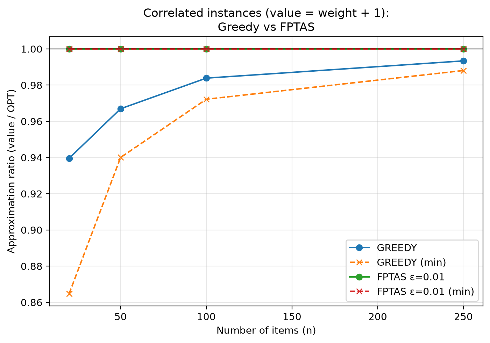
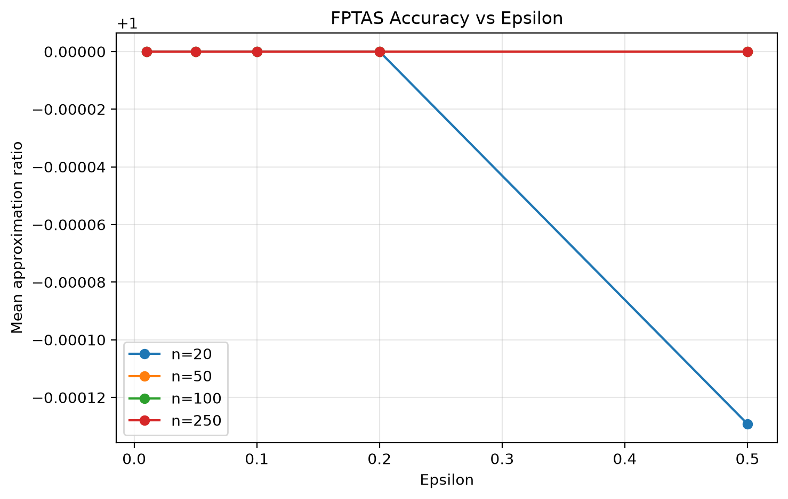
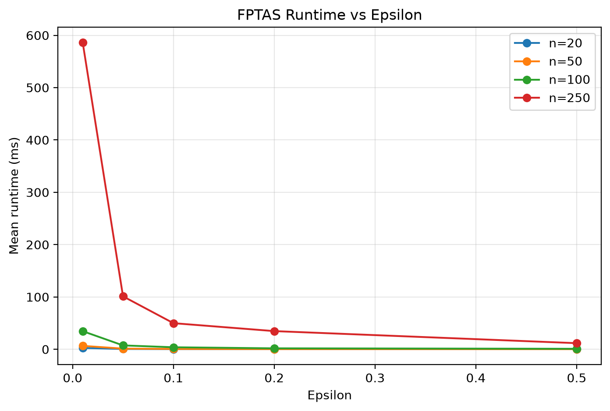
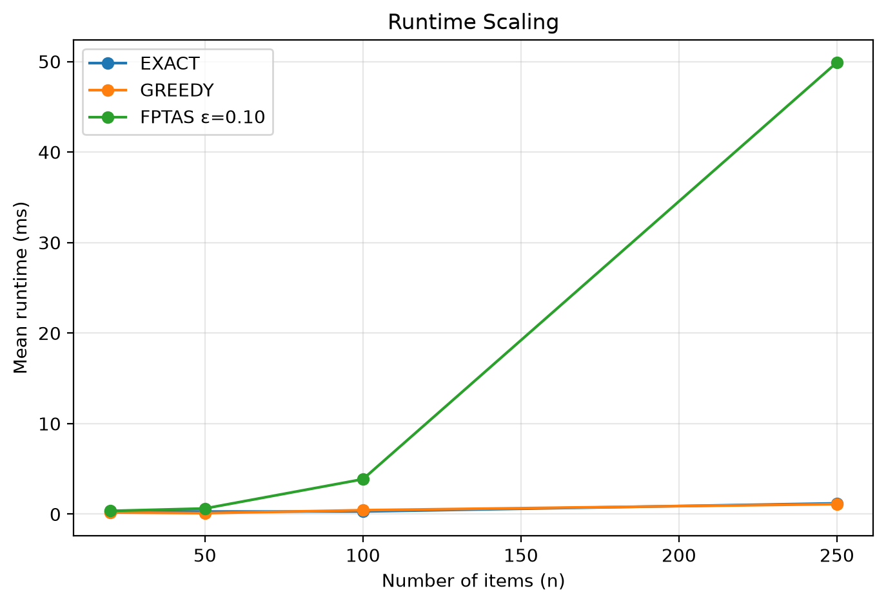

# KnapsackFPTAS

An experimental comparison of three algorithms for the **0/1 knapsack problem**:

| Algorithm | Role |
|---|---|
| Exact DP | Ground-truth optimum (weight-indexed dynamic programming) |
| Density Greedy | Fast baseline (sort by value/weight ratio, take if it fits; compared against best single item) |
| FPTAS | Near-optimal polynomial-time approximation with controllable accuracy ε |

## Problem definition

Given `n` items, each with weight `wᵢ` and value `vᵢ`, and capacity `C`, maximise
Σ `vᵢ` subject to Σ `wᵢ ≤ C`, choosing each item at most once.

## Algorithms

### Exact DP
`dp[w]` table over capacity, iterating items in reverse weight order:
dp[w] = max(dp[w], dp[w − wᵢ] + vᵢ). Returns the true optimum — used as ground truth
for all ratio calculations.

### Greedy
Sorts items by descending value/weight ratio and takes each item if it fits.
Final answer is `max(greedy fill, best single item that fits)` — the latter gives the
heuristic its provable 2-approximation bound.

### FPTAS
Scales values down before running a value-indexed DP. With `V = max i vᵢ`:

    K = ε·V / n
    vᵢ' = ⌊ vᵢ / K ⌋

`dp[i][v']` = minimum weight to reach scaled value `v'` using first `i` items.
The best feasible scaled value is reconstructed back to the original item values.
A runtime guard throws if a solution ever exceeds capacity (feasibility invariant).

## Experiments

### Setup
- **Random instances:** `n = 20, 50, 100, 250`, 30 instances each (120 total),
  capacity = 0.4 × total item weight, weights and values drawn from `1…100`.
- **Correlated instances (extension):** same sizes, but `value = weight + 1`, which
  makes every value/weight ratio nearly identical — the regime that stresses greedy.
- **Fixed seed 42** for full reproducibility (`InstanceGenerator`).
- Epsilons: `0.50, 0.20, 0.10, 0.05, 0.01`.
- Measurements are single-shot `System.nanoTime` runs (per-instance).

Output: `results.csv` (random) and `correlated_results.csv` (correlated), 840 rows each.

### How to run

```bash
javac src/knapsack/*.java

# Random-instance experiment
java -cp src knapsack.Main

# Correlated-instance experiment (extension)
java -cp src knapsack.CorrelatedExperiment

# Analysis + figures
python3 -m venv analysis/.venv
analysis/.venv/bin/pip install pandas matplotlib
analysis/.venv/bin/python analysis/analyze.py
```

Figure output goes in `analysis/figures/`.

## Results

### Random instances: FPTAS ≈ optimum at every ε

| n | Greedy mean ratio | Greedy min ratio | FPTAS (ε=0.5) mean | FPTAS (ε=0.1) mean | FPTAS (ε=0.01) mean |
|---|---|---|---|---|---|
| 20 | 0.9915 | 0.9562 | 1.0000 | 1.0000 | 1.0000 |
| 50 | 0.9965 | 0.9877 | 1.0000 | 1.0000 | 1.0000 |
| 100 | 0.9982 | 0.9956 | 1.0000 | 1.0000 | 1.0000 |
| 250 | 0.9995 | 0.9978 | 1.0000 | 1.0000 | 1.0000 |

Greedy improves as n grows; FPTAS finds the optimum in essentially every random instance.

### Correlated instances: greedy degrades, FPTAS holds

| n | Greedy mean ratio | Greedy min ratio |
|---|---|---|
| 20 | **0.9396** | **0.8648** |
| 50 | **0.9669** | 0.9400 |
| 100 | **0.9839** | 0.9722 |
| 250 | 0.9934 | 0.9881 |

FPTAS is unaffected: ratio 1.0 at every ε ≤ 0.10, and ≥ 0.989 even at ε = 0.50.






### Runtime / ε tradeoff

FPTAS runtime grows sharply as ε shrinks (n = 250, one instance):

| ε | runtime (ms) |
|---|---|
| 0.50 | ≈ 12–15 |
| 0.20 | ≈ 33–43 |
| 0.10 | ≈ 50–67 |
| 0.05 | ≈ 100–135 |
| 0.01 | ≈ 530–750 |

This is exactly the expected FPTAS behaviour: smaller ε means less scaling, a bigger
value-indexed DP table, and higher cost.

## Failure analysis

On the worst correlated instance (n = 20, seed 42 instance 14, ratio 0.8648),
`FailAnalysis` shows *why* greedy fails: with `value = weight + 1` all ratios are
nearly equal (~1.01–1.14), so greedy's sort order is effectively meaningless and it
packs "biggest that fits". Greedy left **53/380** capacity unused (weight 327, value 339);
the optimum packed exactly 380/380 (value 392). Because `value ≈ weight`, wasted capacity
is essentially lost value — greedy's low-ratio tail items (weights 44, 48, 59) should have
been swapped for two medium items (weights 66, 89) that fit tightly. The FPTAS has no such
tie-breaking pathology because it optimises the scaled-value DP globally.

## Discussion

- On random instances all three algorithms perform similarly; greedy approaches the
  optimum as n grows and the best single item rarely matters.
- Correlated instances make greedy's worst case visible (down to 0.865) while the FPTAS
  stays pinned near 1.0 — the approximation guarantee matters exactly where greedy breaks.
- The ε → runtime curve is the expected cost of tighter guarantees; ε = 0.01 costs
  ~50× more than ε = 0.50 at n = 250.

## Limitations

- Runtime uses single-shot per-algorithm timing; JVM noise dominates small instances
  (repetition/median timing would tighten the numbers).
- Instances are small (n ≤ 250); scaling to 500–1000 was deferred so the correlated
  finding could land first.
- Greedy values on correlated instances did not change after adding the best-single-item
  comparison — the observed failure mode is structural, not a missing tie-break.